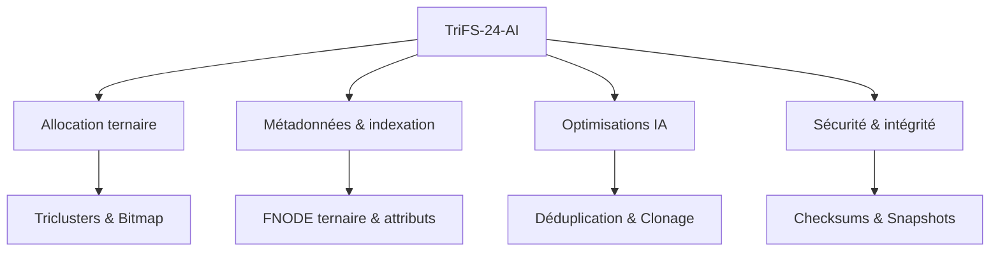

# Diagramme d’architecture TriFS-24‑AI

```mermaid
flowchart TB
  A[TriFS-24‑AI] --> B[Allocation ternaire]
  A --> C[Métadonnées & indexation]
  A --> D[Optimisations IA]
  A --> E[Sécurité & intégrité]
  B --> B1[Triclusters & Bitmap]
  C --> C1[FNODE ternaire & attributs]
  D --> D1[Déduplication & Clonage]
  E --> E1[Checksums & Snapshots]
```
