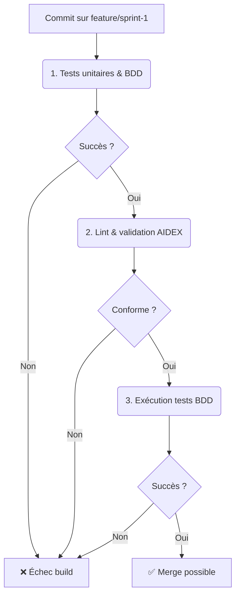

# Sprint 1 - Initialisation du crate Rust TriFS-24 (BP-01-TRI)

**Date :** 2025-04-17

## 🎯 Objectifs du sprint

- **US1 :** Diagramme Mermaid du modèle d’allocation ternaire.
- **US2 :** Initialiser le crate Rust `trifs24_allocator`.
- **US3 :** Tests BDD en Rust pour les états libre/occupé/réservé.
- **US4 :** Blueprint Sprint 1 documenté.
- **US5 :** Wireframe SVG interface diagnostic.

---

## 📁 1. Cartographie des fichiers

| Chemin                                              | Statut   | Responsabilité                           | Artefact lié             |
|-----------------------------------------------------|:--------:|------------------------------------------|--------------------------|
| `crates/trifs24_allocator/Cargo.toml`               | À créer  | Définir le crate Rust `trifs24_allocator` | Blueprint BP-01-TRI      |
| `crates/trifs24_allocator/src/lib.rs`               | À créer  | Module allocateur ternaire               | –                        |
| `specs/allocation_model.mmd`                        | À créer  | Diagramme Mermaid du modèle d’allocation | allocation_model.mmd     |
| `ui/diag_wireframe.svg`                             | À créer  | Wireframe SVG interface diagnostic       | diag_wireframe.svg       |
| `tests/features/allocation.feature`                 | À créer  | Scénarios BDD pour allocation (Rust)     | allocation.feature       |

---

## 📋 2. User Stories & Tâches

| #    | User Story                                                                   | Tâches à réaliser                              |
|:----:|-------------------------------------------------------------------------------|------------------------------------------------|
| US1  | En tant qu’architecte, je veux un **diagramme d’allocation** ternaire.       | Rédiger `specs/allocation_model.mmd`           |
| US2  | En tant que dev, je veux initialiser le **crate Rust** `trifs24_allocator`. | Créer `crates/trifs24_allocator/Cargo.toml` et `crates/trifs24_allocator/src/lib.rs` |
| US3  | En tant que QA, je veux des **tests BDD** en Rust pour états libre/occupé/réservé.  | Écrire `tests/features/allocation.feature`     |
| US4  | En tant que PO, je veux un **Blueprint Sprint 1** documenté.                 | Créer `docs/blueprints/BP-01-TRI.md`           |
| US5  | En tant qu’UX, je veux un **wireframe SVG** pour le tableau de bord.         | Générer `ui/diag_wireframe.svg`                |

---

## 🖋️ 3. Scénarios BDD (extrait)

```gherkin
Feature: Allocation ternaire de triclusters
  Scenario: Allouer un tricluster libre
    Given un volume initialisé avec tous les triclusters à l'état "libre"
    When j’alloue 1 tricluster
    Then un tricluster passe à l'état "occupé"

  Scenario: Réserver un tricluster pour métadonnées
    Given un volume initialisé avec tous les triclusters à l'état "libre"
    When je réserve 1 tricluster en mode "métadonnées"
    Then ce tricluster passe à l'état "réservé"
```

---

## 🔄 4. Pipeline CI/CD AIDEX



---

## ✅ 5. Validation & Revue

- Chaque PR doit inclure :
  - le diagramme Mermaid,
  - les fichiers créés,
  - la référence au Blueprint BP-01-TRI.
- Revue humaine obligatoire avant merge.

---

**Prêt à démarrer !**
