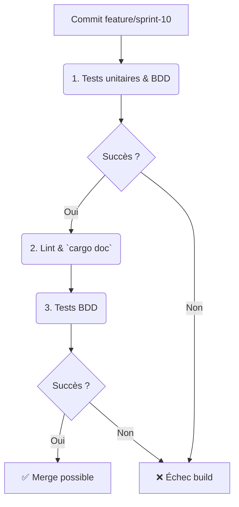

**Date :** 2025-04-24

## 🎯 Objectifs du sprint

- US7 : En tant que dev, implémenter le module **metadata** (FNODE, attributs).  
- US8 : En tant que dev, développer l’**indexation vectorielle** (VectorIndex).  
- US9 : En tant que dev, ajouter le **journal** ternaire (journalisation de transactions).  
- US10 : En tant que dev, créer le **snapshot** et versionnage.  
- US11 : En tant que QA, écrire des scénarios BDD pour metadata, index, journal et snapshot.  
- US12 : En tant que PO, produire le Blueprint Sprint 10 (`BP-10-TRI`).

---

## 📁 1. Cartographie des fichiers

| Chemin                                                         | Statut    | Responsabilité                           | Artefact lié               |
|----------------------------------------------------------------|:---------:|------------------------------------------|----------------------------|
| `crates/trifs24_allocator/src/metadata.rs`                    | À créer   | Définition du FNODE et des attributs     | specs/metadata_model.mmd   |
| `crates/trifs24_allocator/src/vector_index.rs`                | À créer   | Stockage/recherche d’embeddings IA       | specs/indexing_model.mmd   |
| `crates/trifs24_allocator/src/journal.rs`                     | À créer   | Journalisation ternaire des opérations   | specs/journal_model.mmd    |
| `crates/trifs24_allocator/src/snapshot.rs`                    | À créer   | Gestion des snapshots & versionning      | specs/snapshot_model.mmd   |
| `crates/trifs24_allocator/src/lib.rs`                         | Modifier  | `mod metadata; mod vector_index; mod journal; mod snapshot;`  | –                          |
| `crates/trifs24_allocator/tests/features/metadata.feature`    | À créer   | Scénarios BDD metadata                   | metadata.feature           |
| `crates/trifs24_allocator/tests/features/indexing.feature`    | À créer   | Scénarios BDD vector index               | indexing.feature           |
| `crates/trifs24_allocator/tests/features/journal.feature`     | À créer   | Scénarios BDD journal                    | journal.feature            |
| `crates/trifs24_allocator/tests/features/snapshot.feature`    | À créer   | Scénarios BDD snapshot                   | snapshot.feature           |
| `specs/metadata_model.mmd`                                    | À créer   | Diagramme FNODE & attributs              | metadata_model.mmd         |
| `specs/indexing_model.mmd`                                    | À créer   | Diagramme index vectoriel                | indexing_model.mmd         |
| `specs/journal_model.mmd`                                     | À créer   | Diagramme journal ternaire               | journal_model.mmd          |
| `specs/snapshot_model.mmd`                                    | À créer   | Diagramme snapshot/versionning           | snapshot_model.mmd         |
| `docs/blueprints/BP-10-TRI.md`                                | À créer   | Blueprint Sprint 10                      | BP-10-TRI                  |

---

## 📋 2. Scénarios BDD (extraits)
```gherkin
Feature: Métadonnées
  Scenario: Ajouter et récupérer un attribut
    Given un FNode initialisé vide
    When j'ajoute l'attribut "clé" avec "valeur"
    Then get_attr("clé") retourne "valeur"

Feature: Indexation vectorielle
  Scenario: Ajouter et récupérer un vecteur
    Given un VectorIndex initialisé vide
    When j'ajoute un vecteur [0.1,0.2,0.3] pour id "doc1"
    Then query_similar([0.1,0.2,0.3], 1) retourne ["doc1"]

Feature: Journalisation
  Scenario: Journal de transaction
    Given un Journal initialisé
    When j'exécute la transaction "t1"
    Then le dernier événement journal contient "t1"

Feature: Snapshot
  Scenario: Snapshot & restauration
    Given un SnapshotManager initialisé
    When je prends un snapshot
    And j'effectue une allocation
    And je restaure le dernier snapshot
    Then status() revient à l'état initial
```

---

## 🔄 3. Pipeline CI/CD AIDEX


---

## ✅ 4. Validation & Revue

- Chaque PR doit inclure : modules `metadata.rs`, `vector_index.rs`, `journal.rs`, `snapshot.rs`, diagrammes, tests unitaires & BDD.  
- Vérifier la conformité des diagrammes `specs/*.mmd`.  
- Revue du Blueprint `BP-10-TRI` pour approbation PO.  
- Exécution de `cargo test` et validation avec `RUST_LOG`.
