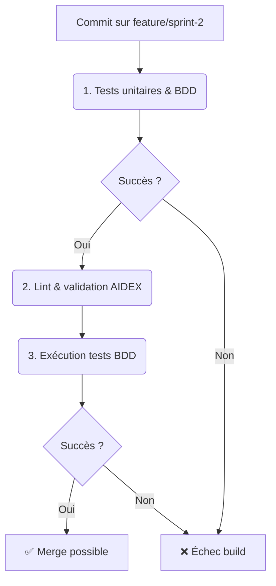

# Sprint 2 - Implémentation du module allocation & tests BDD (BP-02-TRI)

**Date :** 2025-04-17

## 🎯 Objectifs du sprint

- **US1 :** En tant que dev, je veux une méthode `free(index: usize)` pour libérer un tricluster.
- **US2 :** En tant que dev, je veux une méthode `status()` renvoyant le nombre de triclusters par état.
- **US3 :** En tant que QA, je veux des tests BDD pour `free` et `status`.
- **US4 :** En tant qu’architecte, je veux un diagramme Mermaid mis à jour.
- **US5 :** En tant que PO, je veux ce Blueprint documenté.

---

## 📁 1. Cartographie des fichiers

| Chemin                                                      | Statut     | Responsabilité                                      | Artefact lié                   |
|-------------------------------------------------------------|:----------:|-----------------------------------------------------|--------------------------------|
| `crates/trifs24_allocator/src/lib.rs`                       | Modifier   | Ajouter `free` et `status` dans le module           | specs/allocation_model_updated.mmd |
| `specs/allocation_model.mmd`                                | Modifier   | Mettre à jour le diagramme pour `free`/`status`     | specs/allocation_model_updated.mmd |
| `crates/trifs24_allocator/tests/features/allocation.feature`| À créer    | Scénarios BDD pour `free` et `status`               | tests/features/allocation.feature |
| `docs/blueprints/BP-02-TRI.md`                              | Créer      | Blueprint du Sprint 2                                | BP-02-TRI                      |

---

## 📋 2. User Stories & Tâches

| US    | User Story                                                                           | Tâches à réaliser                                               |
|:-----:|--------------------------------------------------------------------------------------|------------------------------------------------------------------|
| US1   | Je veux libérer un tricluster existant via `Allocator::free(idx)`                   | Implémenter la méthode `free` dans `lib.rs`                      |
| US2   | Je veux connaître le nombre de triclusters libres/occupés/réservés via `status()`   | Ajouter une méthode `status` et struct `Status` dans `lib.rs`   |
| US3   | Je veux des scénarios BDD couvrant `free` et `status`                               | Écrire `crates/trifs24_allocator/tests/features/allocation.feature`|
| US4   | Je veux un diagramme Mermaid reflétant `free` et `status`                           | Modifier `specs/allocation_model.mmd`                            |
| US5   | Je veux ce Blueprint Sprint 2 documenté                                            | Créer `docs/blueprints/BP-02-TRI.md`                             |

---

## 🖋️ 3. Scénarios BDD (extrait)

```gherkin
Feature: Gestion complète des triclusters
  Scenario: Libération d'un tricluster occupé
    Given un allocateur initialisé avec 1 tricluster alloué et 1 réservé
    When j'appelle `free(0)`
    Then l'état du tricluster 0 passe à "libre"

  Scenario: Lecture du statut global
    Given un allocateur avec états [libre, occupé, réservé]
    When j'appelle `status()`
    Then la structure renvoie `{free:1, used:1, reserved:1}`
```

---

## 🔄 4. Pipeline CI/CD AIDEX



---

## ✅ 5. Validation & Revue

- Chaque PR inclut les tests unitaires, les scénarios BDD et le diagramme Mermaid mis à jour.
- Revue humaine obligatoire et vérification de la conformité au Blueprint.
