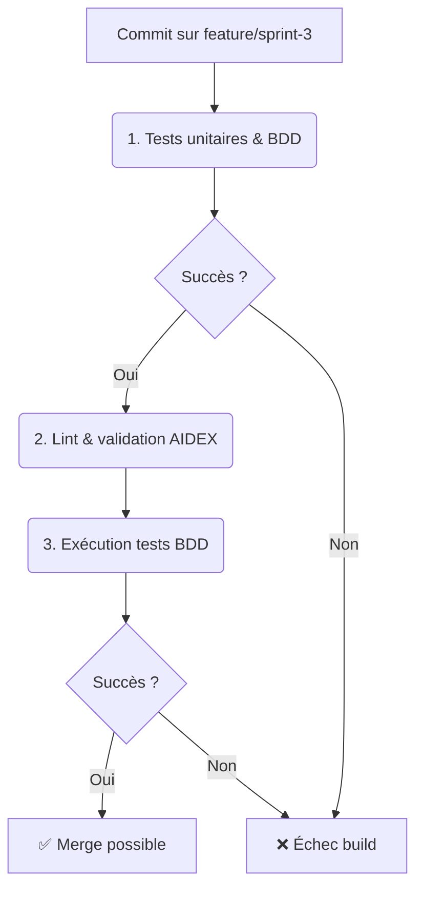

# Sprint 3 - Métadonnées & Indexation vectorielle (BP-03-TRI)

**Date :** 2025-04-17

## 🎯 Objectifs du sprint

- **US1 :** En tant qu’architecte, je veux un diagramme Mermaid du modèle de métadonnées (`FNode`).
- **US2 :** En tant que dev, je veux implémenter un module `metadata` (`set_attr` / `get_attr`).
- **US3 :** En tant que dev, je veux stubber un module `index` vectoriel (`insert` / `query`).
- **US4 :** En tant que QA, je veux des scénarios BDD pour `metadata`.
- **US5 :** En tant que QA, je veux des scénarios BDD pour `index`.
- **US6 :** En tant que PO, je veux ce Blueprint documenté.

---

## 📁 1. Cartographie des fichiers

| Chemin                                                        | Statut     | Responsabilité                                       | Artefact lié             |
|---------------------------------------------------------------|:----------:|------------------------------------------------------|--------------------------|
| `crates/trifs24_allocator/src/metadata.rs`                    | À créer    | Module de gestion des métadonnées                    | specs/metadata_model.mmd |
| `crates/trifs24_allocator/src/index.rs`                       | À créer    | Module index vectoriel stub                          | specs/index_model.mmd    |
| `crates/trifs24_allocator/src/lib.rs`                         | Modifier    | `mod metadata; mod index; pub use metadata::FNode;` | –                        |
| `specs/metadata_model.mmd`                                    | À créer    | Diagramme du modèle `FNode`                          | metadata_model.mmd       |
| `specs/index_model.mmd`                                       | À créer    | Diagramme du modèle `VectorIndex`                    | index_model.mmd          |
| `crates/trifs24_allocator/tests/features/metadata.feature`    | À créer    | Scénarios BDD pour `set_attr`/`get_attr`             | metadata.feature         |
| `crates/trifs24_allocator/tests/features/indexing.feature`    | À créer    | Scénarios BDD pour `insert`/`query`                  | indexing.feature         |
| `docs/blueprints/BP-03-TRI.md`                                | À créer    | Blueprint Sprint 3                                    | BP-03-TRI                |

---

## 📋 2. User Stories & Tâches

| US   | User Story                                                                      | Tâches à réaliser                                             |
|:----:|---------------------------------------------------------------------------------|----------------------------------------------------------------|
| US1  | Je veux un diagramme Mermaid du modèle de `FNode`.                             | Rédiger `specs/metadata_model.mmd`                             |
| US2  | Je veux implémenter `metadata::set_attr` et `get_attr` dans `metadata.rs`.     | Créer `src/metadata.rs` et déclarer `mod metadata` dans `lib.rs` |
| US3  | Je veux stubber un `VectorIndex` avec `insert` & `query`.                     | Créer `src/index.rs` et déclarer `mod index` dans `lib.rs`     |
| US4  | Je veux des scénarios BDD pour le module `metadata`.                           | Écrire `tests/features/metadata.feature`                       |
| US5  | Je veux des scénarios BDD pour le module `index`.                              | Écrire `tests/features/indexing.feature`                       |
| US6  | Je veux ce Blueprint documenté pour Sprint 3.                                   | Créer `docs/blueprints/BP-03-TRI.md`                           |

---

## 🖋️ 3. Scénarios BDD (extraits)

```gherkin
Feature: Gestion des métadonnées
  Scenario: Ajouter et récupérer un attribut
    Given un fichier initialisé sans attributs
    When j'appelle set_attr("clef", "valeur")
    Then get_attr("clef") renvoie Some("valeur")

Feature: Indexation vectorielle
  Scenario: Ajouter et récupérer un vecteur
    Given un index initialisé vide
    When j'appelle insert(1, [0.1, 0.2])
    Then query(1) renvoie Some([0.1, 0.2])
```

---

## 🔄 4. Pipeline CI/CD AIDEX



---

## ✅ 5. Validation & Revue

- Chaque PR inclut : code `metadata`, `index`, diagrammes et scénarios BDD.
- Revue humaine obligatoire et vérification de la conformité au Blueprint.
