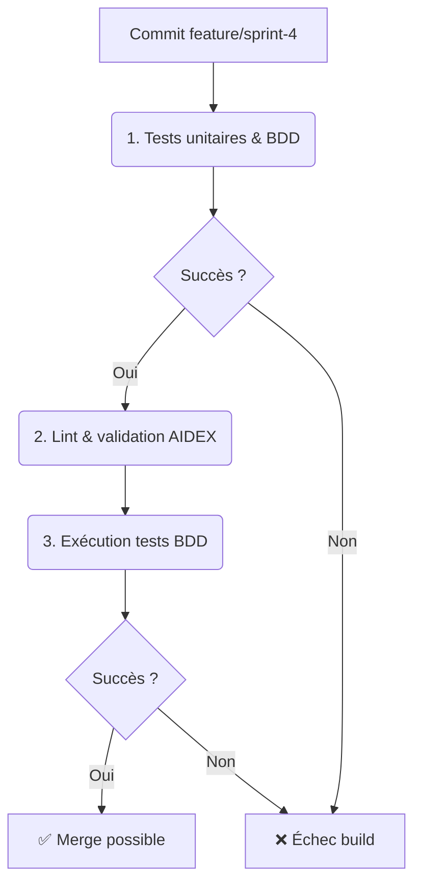

# Sprint 4 - Optimisations IA & pipeline prédictif (BP-04-TRI)

**Date :** 2025-04-17

## 🎯 Objectifs du sprint

- **US1 :** En tant que dev, implémenter un algorithme d’allocation prédictif (`PredictiveAllocator`).
- **US2 :** En tant que dev, créer un pipeline de préchargement prédictif (`PreloadPipeline`).
- **US3 :** En tant que QA, écrire des scénarios BDD pour le module prédictif et le pipeline.
- **US4 :** En tant qu’architecte, fournir un diagramme Mermaid des modèles `PredictiveAllocator` et `PreloadPipeline`.
- **US5 :** En tant que PO, documenter le Blueprint du Sprint 4.

---

## 📁 1. Cartographie des fichiers

| Chemin                                                        | Statut     | Responsabilité                                      | Artefact lié                 |
|---------------------------------------------------------------|:----------:|-----------------------------------------------------|------------------------------|
| `crates/trifs24_allocator/src/predictive.rs`                 | À créer    | Implémentation de l’allocateur prédictif           | specs/predictive_model.mmd   |
| `crates/trifs24_allocator/src/preload.rs`                    | À créer    | Pipeline de préchargement IA                       | specs/preload_model.mmd      |
| `crates/trifs24_allocator/src/lib.rs`                        | Modifier   | `mod predictive; mod preload; pub use predictive::*; pub use preload::*;` | –                            |
| `specs/predictive_model.mmd`                                 | À créer    | Diagramme `PredictiveAllocator`                     | predictive_model.mmd         |
| `specs/preload_model.mmd`                                    | À créer    | Diagramme `PreloadPipeline`                         | preload_model.mmd            |
| `crates/trifs24_allocator/tests/features/predictive.feature` | À créer    | Scénarios BDD pour `PredictiveAllocator`           | predictive.feature           |
| `crates/trifs24_allocator/tests/features/preload.feature`    | À créer    | Scénarios BDD pour `PreloadPipeline`               | preload.feature              |
| `docs/blueprints/BP-04-TRI.md`                               | Créer      | Blueprint du Sprint 4                               | BP-04-TRI                    |

---

## 📋 2. User Stories & Tâches

| US   | User Story                                                                          | Tâches à réaliser                                             |
|:----:|-------------------------------------------------------------------------------------|----------------------------------------------------------------|
| US1  | Je veux un allocateur prédictif IA via `PredictiveAllocator::predictive_alloc()`   | Créer `src/predictive.rs` et déclarer `mod predictive` dans `lib.rs` |
| US2  | Je veux un pipeline de préchargement (`PreloadPipeline::preload()`)                | Créer `src/preload.rs` et déclarer `mod preload` dans `lib.rs`      |
| US3  | Je veux des scénarios BDD pour ces modules                                         | Écrire `tests/features/predictive.feature` et `preload.feature`      |
| US4  | Je veux un diagramme Mermaid mis à jour                                             | Rédiger `specs/predictive_model.mmd` et `specs/preload_model.mmd`   |
| US5  | Je veux le Blueprint documenté                                                      | Créer `docs/blueprints/BP-04-TRI.md`                               |

---

## 🖋️ 3. Scénarios BDD (extraits)

```gherkin
Feature: Allocation prédictive IA
  Scenario: Allocation basée sur l'historique d'accès
    Given un allocateur prédictif initialisé
    When j'appelle predictive_alloc()
    Then il retourne un index optimal

Feature: Pipeline de préchargement
  Scenario: Préchargement de blocs à venir
    Given un PreloadPipeline initialisé
    When j'appelle preload([0,1,2])
    Then les triclusters 0,1,2 sont préchargés
```

---

## 🔄 4. Pipeline CI/CD AIDEX



---

## ✅ 5. Validation & Revue

- Chaque PR inclura le code, tests unitaires & BDD, diagrammes Mermaid.  
- Revue humaine et conformité au Blueprint.
