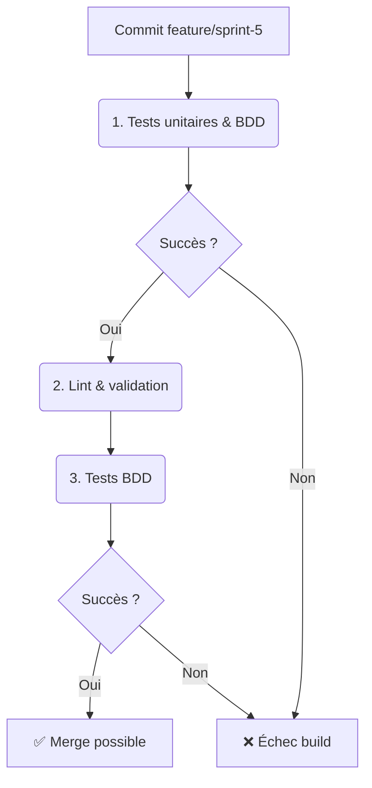

# Sprint 5 - Sécurité avancée & snapshots (BP-05-TRI)

**Date :** 2025-04-17

## 🎯 Objectifs du sprint

- **US1 :** En tant que dev, je veux implémenter les **checksums ternaires** par bloc.
- **US2 :** En tant que dev, je veux créer un système de **snapshots & versionnage**.
- **US3 :** En tant que dev, je veux stubber le **chiffrement bloc par bloc**.
- **US4 :** En tant que QA, je veux des scénarios BDD pour les checksums et snapshots.
- **US5 :** En tant que QA, je veux des scénarios BDD pour le chiffrement.
- **US6 :** En tant que PO, je veux ce Blueprint documenté.

---

## 📁 1. Cartographie des fichiers

| Chemin                                                          | Statut     | Responsabilité                   | Artefact lié               |
|-----------------------------------------------------------------|:----------:|----------------------------------|----------------------------|
| `crates/trifs24_allocator/src/checksum.rs`                     | À créer    | Module checksum                  | specs/checksum_model.mmd   |
| `crates/trifs24_allocator/src/snapshot.rs`                     | À créer    | Module snapshot/versioning       | specs/snapshot_model.mmd   |
| `crates/trifs24_allocator/src/crypto.rs`                       | À créer    | Stub de chiffrement bloc par bloc| specs/crypto_model.mmd     |
| `crates/trifs24_allocator/src/lib.rs`                          | Modifier   | `mod checksum; mod snapshot; mod crypto; pub use ...` | –                   |
| `specs/checksum_model.mmd`                                     | À créer    | Diagramme du modèle `Checksum`   | checksum_model.mmd         |
| `specs/snapshot_model.mmd`                                     | À créer    | Diagramme du modèle `Snapshot`   | snapshot_model.mmd         |
| `specs/crypto_model.mmd`                                       | À créer    | Diagramme du modèle `Crypto`     | crypto_model.mmd           |
| `crates/.../tests/features/checksum.feature`                   | À créer    | Scénarios BDD checksums          | checksum.feature           |
| `crates/.../tests/features/snapshot.feature`                   | À créer    | Scénarios BDD snapshots          | snapshot.feature           |
| `crates/.../tests/features/crypto.feature`                     | À créer    | Scénarios BDD chiffrement        | crypto.feature             |
| `docs/blueprints/BP-05-TRI.md`                                 | À créer    | Blueprint Sprint 5               | BP-05-TRI                  |

---

## 📋 2. User Stories & Tâches

| US   | User Story                                                       | Tâches à réaliser                                 |
|:----:|------------------------------------------------------------------|----------------------------------------------------|
| US1  | Je veux calculer et vérifier un checksum ternaire par bloc       | Créer `src/checksum.rs`                            |
| US2  | Je veux créer/restaurer des snapshots de l’état du FS           | Créer `src/snapshot.rs`                            |
| US3  | Je veux stubber le chiffrement/déchiffrement bloc par bloc       | Créer `src/crypto.rs`                              |
| US4  | Je veux des scenarios BDD pour checksum et snapshots            | Écrire `tests/features/checksum.feature` et `snapshot.feature` |
| US5  | Je veux des scenarios BDD pour le chiffrement                   | Écrire `tests/features/crypto.feature`             |
| US6  | Je veux le Blueprint documenté pour Sprint 5                     | Créer `docs/blueprints/BP-05-TRI.md`               |

---

## 🖋️ 3. Scénarios BDD (extraits)

```gherkin
Feature: Checksums ternaires
  Scenario: Calcul et vérification
    Given un bloc de données [0,1,2]
    When j'appelle compute_checksum(block)
    Then compute_checksum renvoie une valeur
    And verify_checksum(block, checksum) renvoie true

Feature: Snapshots & versionnage
  Scenario: Création et restauration
    Given un FS initialisé
    When j'appelle create_snapshot("v1")
    Then restore_snapshot("v1") rétablit l’état précédent

Feature: Chiffrement bloc par bloc
  Scenario: Encrypt/Decrypt
    Given un bloc [0,1,2]
    When j'appelle encrypt_block(key, block)
    Then decrypt_block(key, output) renvoie le bloc original
```

---

## 🔄 4. Pipeline CI/CD AIDEX



---

## ✅ 5. Validation & Revue

- Chaque PR inclut code, tests unitaires & BDD, diagrammes Mermaid.  
- Revue humaine et vérification de la conformité au Blueprint.
