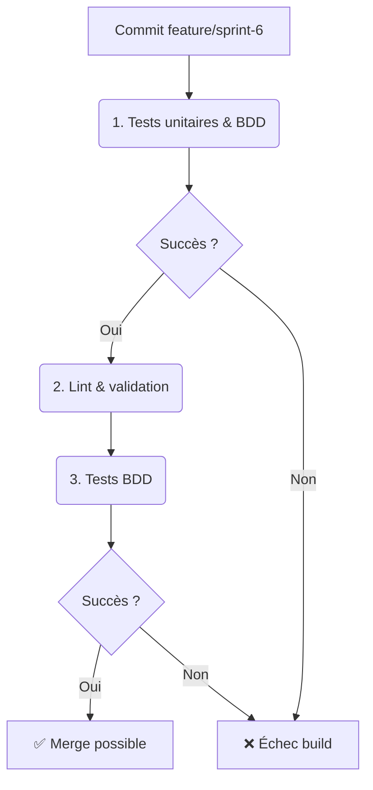

# Sprint 6 - Interfaces & Intégration (BP-06-TRI)

**Date :** 2025-04-17

## 🎯 Objectifs du sprint

- US1 : En tant que dev, je veux un module **VFS FUSE-like** (`vfs.rs`) pour monter TriFS‑24.
- US2 : En tant que dev, je veux un stub de **connecteurs IA** (`connectors.rs`) pour TensorFlow & PyTorch.
- US3 : En tant que QA, je veux des scénarios BDD pour le VFS (mount, lecture/écriture).
- US4 : En tant que QA, je veux des scénarios BDD pour les connecteurs IA.
- US5 : En tant que PO, je veux ce Blueprint documenté.

---

## 📁 1. Cartographie des fichiers

| Chemin                                                      | Statut     | Responsabilité                       | Artefact lié               |
|-------------------------------------------------------------|:----------:|--------------------------------------|----------------------------|
| `crates/trifs24_allocator/src/vfs.rs`                       | À créer    | Module VFS FUSE-like                 | specs/vfs_model.mmd        |
| `crates/trifs24_allocator/src/connectors.rs`                | À créer    | Stub connecteurs IA                  | specs/connectors_model.mmd |
| `crates/trifs24_allocator/src/lib.rs`                       | Modifier   | `mod vfs; mod connectors; pub use`   | –                          |
| `specs/vfs_model.mmd`                                       | À créer    | Diagramme UML du VFS                 | vfs_model.mmd              |
| `specs/connectors_model.mmd`                                | À créer    | Diagramme UML des connecteurs IA     | connectors_model.mmd       |
| `crates/.../tests/features/vfs.feature`                     | À créer    | Scénarios BDD VFS                    | vfs.feature                |
| `crates/.../tests/features/connectors.feature`              | À créer    | Scénarios BDD connecteurs IA         | connectors.feature         |
| `docs/blueprints/BP-06-TRI.md`                              | À créer    | Blueprint Sprint 6                   | BP-06-TRI                  |

---

## 📋 2. Scénarios BDD (extraits)

```gherkin
Feature: VFS TriFS‑24
  Scenario: Montage et opérations
    Given un VFS monté sur un répertoire
    When j'écris "hello" dans /greeting.txt
    Then la lecture de /greeting.txt renvoie "hello"

Feature: Connecteurs IA
  Scenario: Prédiction TensorFlow
    Given un connecteur IA initialisé
    When j'appelle tf_predict([0.1,0.2])
    Then il renvoie un vecteur de sortie
```

---

## 🔄 3. Pipeline CI/CD AIDEX



---

## ✅ 4. Validation & Revue

- Chaque PR inclut code VFS, connecteurs IA, diagrammes, tests unitaires & BDD.  
- Revue humaine et conformité au Blueprint.
