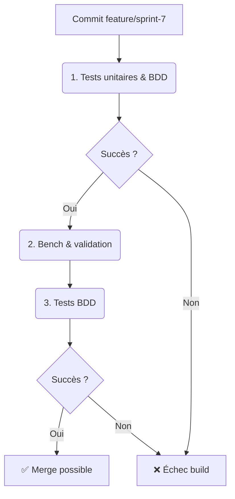

# Sprint 7 - Optimisations & Profiling (BP-07-TRI)

**Date :** 2025-04-17

## 🎯 Objectifs du sprint

- US1 : En tant que dev, je veux profiler l’allocateur et la pipeline IA (CPU et mémoire).
- US2 : En tant que dev, je veux optimiser les algorithmes critiques (allocations prédictives, préchargement).
- US3 : En tant que dev, je veux implémenter un **cache IA** pour réduire la latence des prédictions.
- US4 : En tant que QA, je veux des scénarios BDD pour le profiler et le cache.
- US5 : En tant que PO, je veux le Blueprint documenté.

---

## 📁 1. Cartographie des fichiers

| Chemin                                                      | Statut     | Responsabilité                            | Artefact lié               |
|-------------------------------------------------------------|:----------:|-------------------------------------------|----------------------------|
| `crates/trifs24_allocator/src/profiler.rs`                 | À créer    | Module de profiling CPU/mémoire           | specs/profiler_model.mmd   |
| `crates/trifs24_allocator/src/optimizer.rs`                | À créer    | Module d’optimisation d’algorithmes       | specs/optimizer_model.mmd  |
| `crates/trifs24_allocator/src/cache.rs`                    | À créer    | Module de cache pour IA (TensorFlow/PyTorch) | specs/cache_model.mmd   |
| `crates/trifs24_allocator/src/lib.rs`                      | Modifier   | `mod profiler; mod optimizer; mod cache; pub use ...` | –          |
| `specs/profiler_model.mmd`                                 | À créer    | Diagramme modèle Profiler                 | profiler_model.mmd         |
| `specs/optimizer_model.mmd`                                | À créer    | Diagramme modèle Optimizer                | optimizer_model.mmd        |
| `specs/cache_model.mmd`                                    | À créer    | Diagramme modèle Cache                    | cache_model.mmd            |
| `crates/.../tests/features/profiler.feature`               | À créer    | Scénarios BDD profiling                   | profiler.feature           |
| `crates/.../tests/features/optimizer.feature`              | À créer    | Scénarios BDD optimisation                | optimizer.feature          |
| `crates/.../tests/features/cache.feature`                  | À créer    | Scénarios BDD cache IA                    | cache.feature              |
| `docs/blueprints/BP-07-TRI.md`                             | À créer    | Blueprint Sprint 7                        | BP-07-TRI                  |

---

## 📋 2. Scénarios BDD (extraits)

```gherkin
Feature: Profiling de l’allocation
  Scenario: Mesure du temps d’allocation prédictive
    Given un PredictiveAllocator initialisé
    When j’exécute profiler::profile_predictive(100)
    Then le profiler renvoie un temps en millisecondes

Feature: Cache IA
  Scenario: Mise en cache des prédictions
    Given un cache IA vide
    When j’appelle cache::get_or_compute([0.1,0.2])
    Then la prédiction est mise en cache
    And un second appel renvoie sans recomputation
```

---

## 🔄 3. Pipeline CI/CD AIDEX



---

## ✅ 4. Validation & Revue

- Chaque PR inclut modules `profiler.rs`, `optimizer.rs`, `cache.rs`, diagrammes, tests unitaires & BDD.  
- Benchmarks automatiques pour valider les gains.  
- Revue humaine et conformité au Blueprint.
