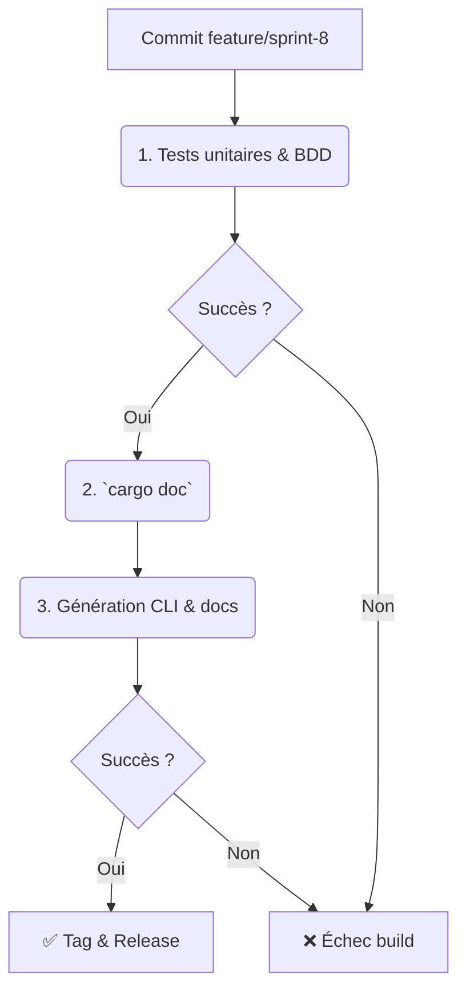

# Sprint 8 - Documentation & Release (BP-08-TRI)

**Date :** 2025-04-17

## 🎯 Objectifs du sprint

- US1 : En tant que dev, je veux produire la **documentation rustdoc** complète de `trifs24_allocator`.
- US2 : En tant que dev, je veux ajouter un **binaire CLI** (`crates/trifs24_cli/src/main.rs`) pour exposer les opérations FS.
- US3 : En tant que QA, je veux des scénarios BDD pour le CLI (mount, alloc, free).
- US4 : En tant que PO, je veux créer un **CHANGELOG.md** et des **tags de release** Git.
- US5 : En tant que PO, je veux un **guide d’utilisation** (`docs/usage.md`) et de **migration**.
- US6 : En tant que PO, je veux le Blueprint documenté.

---

## 📁 1. Cartographie des fichiers

| Chemin                                                         | Statut     | Responsabilité                          | Artefact lié                |
|----------------------------------------------------------------|:----------:|-----------------------------------------|-----------------------------|
| `crates/trifs24_allocator/*`                                   | Documenter | Doc comments et rustdoc                 | –                           |
| `crates/trifs24_cli/src/main.rs`                               | À créer    | Binaire CLI                             | specs/cli_model.mmd         |
| `docs/usage.md`                                                | À créer    | Guide d’utilisation                     | usage.md                    |
| `docs/changelog.md`                                            | À créer    | Changelog et notes de release           | changelog.md                |
| `crates/trifs24_allocator/tests/features/cli.feature`         | À créer    | Scénarios BDD CLI                       | cli.feature                 |
| `specs/cli_model.mmd`                                          | À créer    | Diagramme modèle CLI                    | cli_model.mmd               |
| `docs/blueprints/BP-08-TRI.md`                                | À créer    | Blueprint Sprint 8                      | BP-08-TRI                   |

---

## 📋 2. Scénarios BDD (extraits)

```gherkin
Feature: CLI TriFS-24
  Scenario: Montage via CLI
    Given un répertoire vide
    When j'exécute `trifs24_cli mount ./data /mnt`  
    Then le FS monte sans erreur

Feature: Allocation via CLI
  Scenario: Allouer un bloc
    Given un FS monté
    When j'exécute `trifs24_cli alloc`  
    Then il renvoie l'index du bloc
```

---

## 🔄 3. Pipeline CI/CD AIDEX



---

## ✅ 4. Validation & Revue

- Chaque PR inclut la doc, CLI, tests BDD, CHANGELOG et guide d’utilisation.  
- Validation de la génération `cargo doc`.  
- Revue humaine et conformité au Blueprint.
