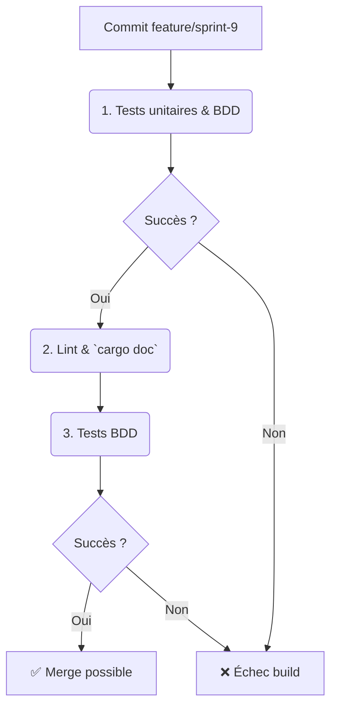

# Sprint 9 - Robustesse, Logging & Metrics (BP-09-TRI)

**Date :** 2025-04-17

## 🎯 Objectifs du sprint

- US1 : En tant que dev, je veux des **types d'erreur** robustes pour l’allocateur et la pipeline (Result<T, Error>).  
- US2 : En tant que dev, je veux intégrer du **logging** (niveau INFO/DEBUG) dans tous les modules.  
- US3 : En tant que dev, je veux exposer des **métriques** (Prometheus) pour suivre les opérations critiques.  
- US4 : En tant que QA, je veux des scénarios BDD pour les cas d'erreur et le logging.  
- US5 : En tant que QA, je veux des scénarios BDD pour la collection de métriques.  
- US6 : En tant que PO, je veux le Blueprint documenté.

---

## 📁 1. Cartographie des fichiers

| Chemin                                                          | Statut     | Responsabilité                                    | Artefact lié               |
|-----------------------------------------------------------------|:----------:|---------------------------------------------------|----------------------------|
| `crates/trifs24_allocator/src/errors.rs`                       | À créer    | Définition des enums `Error`                      | specs/errors_model.mmd     |
| `crates/trifs24_allocator/src/logging.rs`                      | À créer    | Wrapper sur `log` pour initialization             | specs/logging_model.mmd    |
| `crates/trifs24_allocator/src/metrics.rs`                      | À créer    | Exposition Prometheus des compteurs               | specs/metrics_model.mmd    |
| `crates/trifs24_allocator/src/lib.rs`                          | Modifier   | `mod errors; mod logging; mod metrics; pub use ...` | –                         |
| `crates/trifs24_allocator/tests/features/errors.feature`       | À créer    | Scénarios BDD erreurs (allocate, free)            | errors.feature             |
| `crates/trifs24_allocator/tests/features/logging.feature`      | À créer    | Scénarios BDD logging (INFO/DEBUG)                | logging.feature            |
| `crates/trifs24_allocator/tests/features/metrics.feature`      | À créer    | Scénarios BDD métriques (compteurs)               | metrics.feature            |
| `specs/errors_model.mmd`                                        | À créer    | Diagramme modèle Error                            | errors_model.mmd           |
| `specs/logging_model.mmd`                                      | À créer    | Diagramme modèle Logging                          | logging_model.mmd          |
| `specs/metrics_model.mmd`                                      | À créer    | Diagramme modèle Metrics                          | metrics_model.mmd          |
| `docs/blueprints/BP-09-TRI.md`                                 | À créer    | Blueprint Sprint 9                                | BP-09-TRI                  |

---

## 📋 2. Scénarios BDD (extraits)

```gherkin
Feature: Gestion d'erreurs
  Scenario: Erreur d'allocation
    Given un Allocator initialisé à 0 tricluster
    When j'appelle allocate()
    Then la méthode retourne une erreur `OutOfSpace`

Feature: Logging
  Scenario: Niveau DEBUG
    Given un module initialisé
    When j'écris une opération prédictive
    Then on logge un message DEBUG contenant "predictive_alloc"

Feature: Metrics
  Scenario: Compteur d'allocations
    Given un compteur à zéro
    When j'appelle allocate() trois fois
    Then la métrique `allocator_alloc_total` vaut 3
```

---

## 🔄 3. Pipeline CI/CD AIDEX



---

## ✅ 4. Validation & Revue

- Chaque PR inclut modules `errors.rs`, `logging.rs`, `metrics.rs`, diagrammes, tests unitaires & BDD.  
- Vérification du logging avec `RUST_LOG`.  
- Revue humaine et conformité au Blueprint.
