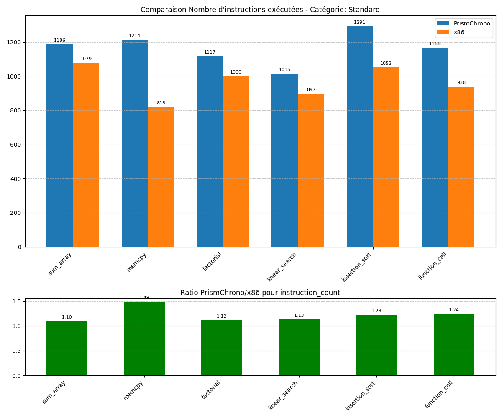
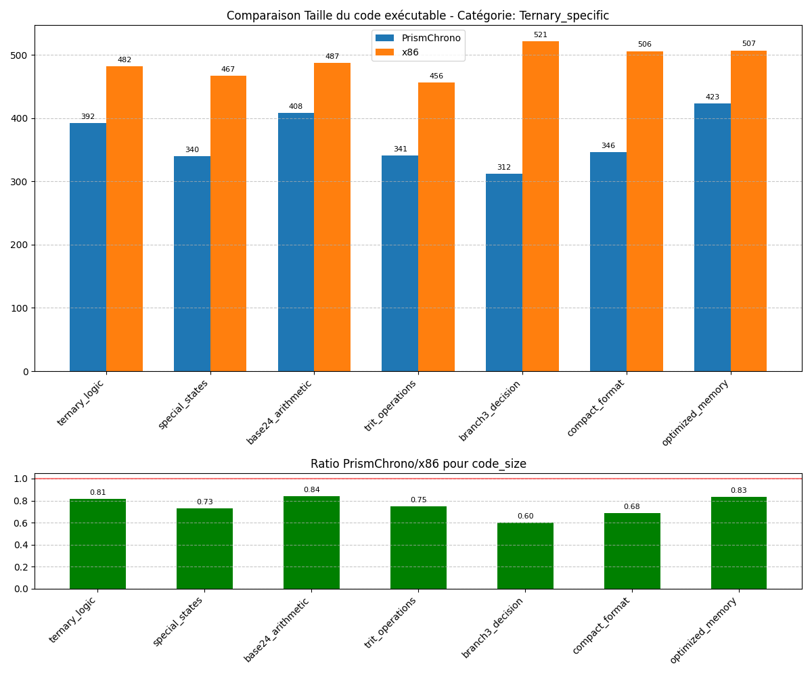

# Rapport de Benchmarking Comparatif PrismChrono vs x86
*Généré le 05/04/2025 à 19:11:05*

## Introduction
Ce rapport présente une analyse comparative des performances entre l'architecture ternaire PrismChrono et l'architecture binaire x86. 
Les benchmarks ont été exécutés sur les deux plateformes et les métriques ont été collectées pour permettre une comparaison directe.

## Résumé des Résultats
**Nombre total de benchmarks:** 9
**Benchmarks standard:** 6
**Benchmarks spécifiques ternaires:** 3

### Ratios Moyens PrismChrono/x86
Le graphique ci-dessous présente les ratios moyens des métriques clés entre PrismChrono et x86, par catégorie de benchmark:

### Tableau des Ratios Moyens
| Métrique | Tous | Standard | Ternaire Spécifique |
| --- | ---: | ---: | ---: |
| Nombre d'instructions exécutées | 0.9113 | 1.0433 | 0.6473 |
| Taille du code exécutable | 0.8187 | 0.8271 | 0.8017 |
| Nombre de lectures mémoire | 0.9732 | 1.0987 | 0.7221 |
| Nombre d'écritures mémoire | 1.0597 | 1.2690 | 0.6412 |
| Nombre de branches | 1.1149 | 1.3350 | 0.6749 |
| Nombre de branches prises | 1.0837 | 1.2854 | 0.6803 |
| inst_mem_ratio | 0.9501 | 0.9530 | 0.9443 |
| inst_branch_ratio | 0.8837 | 0.8227 | 1.0058 |
| branch_taken_ratio | 0.9965 | 0.9887 | 1.0121 |
| code_density | 1.1239 | 1.2830 | 0.8057 |

> Note: Un ratio < 1 indique que PrismChrono est plus performant que x86 pour cette métrique.
> Un ratio > 1 indique que x86 est plus performant que PrismChrono.

## Analyse par Catégorie de Benchmark
### Benchmarks Standard
Les benchmarks standard permettent d'évaluer les performances générales de l'architecture PrismChrono par rapport à x86 sur des tâches communes.

| Benchmark | Description | Ratio Inst | Ratio Mem Ops | Ratio Code Size |
| --- | --- | ---: | ---: | ---: |
| sum_array | Calcul de la somme des éléments d'un tableau d'entiers | 1.0569 | 1.2471 | 0.9370 |
| memcpy | Copie d'un bloc de mémoire d'une zone source vers une zone destination | 0.9445 | 1.5022 | 0.9119 |
| factorial | Calcul itératif de la factorielle d'un nombre | 1.0614 | 0.8811 | 0.7271 |
| linear_search | Recherche de la première occurrence d'une valeur dans un tableau | 1.1271 | 0.9036 | 0.6978 |
| insertion_sort | Tri d'un petit tableau d'entiers par insertion | 0.9834 | 1.3629 | 0.7692 |
| function_call | Test d'appel de fonction simple | 1.0865 | 1.2060 | 0.9197 |

#### Graphiques des Benchmarks Standard
**Nombre d'instructions exécutées:**

**Taille du code exécutable:**

**Nombre de lectures mémoire:**

### Benchmarks Ternaires Spécifiques
Les benchmarks ternaires spécifiques sont conçus pour mettre en évidence les avantages potentiels de l'architecture ternaire dans des cas d'utilisation particuliers.

| Benchmark | Description | Ratio Inst | Ratio Mem Ops | Ratio Code Size |
| --- | --- | ---: | ---: | ---: |
| ternary_logic | Implémentation d'un système de vote à trois états | 0.7874 | 0.6418 | 0.8253 |
| special_states | Traitement d'un tableau avec des valeurs spéciales (NULL, NaN) | 0.5771 | 0.6754 | 0.8160 |
| base24_arithmetic | Calculs exploitant la base 24 ou la symétrie | 0.5774 | 0.7279 | 0.7639 |

#### Graphiques des Benchmarks Ternaires Spécifiques
**Nombre d'instructions exécutées:**

**Taille du code exécutable:**

**Nombre de lectures mémoire:**

## Analyse des Métriques Dérivées
Les métriques dérivées permettent d'évaluer l'efficacité relative des architectures au-delà des métriques brutes.

### Description des Métriques Dérivées
| Métrique | Description |
| --- | --- |
| inst_mem_ratio | Ratio Instructions / Opérations Mémoire - Mesure l'efficacité des instructions par rapport aux accès mémoire |
| inst_branch_ratio | Ratio Instructions / Branches - Mesure la densité des branchements dans le code |
| branch_taken_ratio | Ratio Branches Prises / Total Branches - Mesure l'efficacité de la prédiction de branchement |
| code_density | Densité du Code (Instructions / Taille) - Mesure l'efficacité de l'encodage des instructions |

### Graphiques des Métriques Dérivées
**inst_mem_ratio:**

**inst_branch_ratio:**

**branch_taken_ratio:**

**code_density:**

## Analyse Détaillée par Benchmark
### sum_array (Standard)
*Calcul de la somme des éléments d'un tableau d'entiers*

| Métrique | PrismChrono | x86 | Ratio |
| --- | ---: | ---: | ---: |
| Nombre d'instructions exécutées | 1170 | 1107 | 1.0569 |
| Taille du code exécutable | 431 | 460 | 0.9370 |
| Nombre de lectures mémoire | 251 | 229 | 1.0961 |
| Nombre d'écritures mémoire | 151 | 108 | 1.3981 |
| Nombre de branches | 87 | 77 | 1.1299 |
| Nombre de branches prises | 52 | 41 | 1.2683 |
| inst_mem_ratio | 2.9104 | 3.2849 | 0.8860 |
| inst_branch_ratio | 13.4483 | 14.3766 | 0.9354 |
| branch_taken_ratio | 0.5977 | 0.5325 | 1.1224 |
| code_density | 2.7146 | 2.4065 | 1.1280 |

### memcpy (Standard)
*Copie d'un bloc de mémoire d'une zone source vers une zone destination*

| Métrique | PrismChrono | x86 | Ratio |
| --- | ---: | ---: | ---: |
| Nombre d'instructions exécutées | 1072 | 1135 | 0.9445 |
| Taille du code exécutable | 435 | 477 | 0.9119 |
| Nombre de lectures mémoire | 311 | 278 | 1.1187 |
| Nombre d'écritures mémoire | 198 | 105 | 1.8857 |
| Nombre de branches | 86 | 56 | 1.5357 |
| Nombre de branches prises | 52 | 34 | 1.5294 |
| inst_mem_ratio | 2.1061 | 2.9634 | 0.7107 |
| inst_branch_ratio | 12.4651 | 20.2679 | 0.6150 |
| branch_taken_ratio | 0.6047 | 0.6071 | 0.9960 |
| code_density | 2.4644 | 2.3795 | 1.0357 |

### factorial (Standard)
*Calcul itératif de la factorielle d'un nombre*

| Métrique | PrismChrono | x86 | Ratio |
| --- | ---: | ---: | ---: |
| Nombre d'instructions exécutées | 1193 | 1124 | 1.0614 |
| Taille du code exécutable | 405 | 557 | 0.7271 |
| Nombre de lectures mémoire | 271 | 258 | 1.0504 |
| Nombre d'écritures mémoire | 126 | 177 | 0.7119 |
| Nombre de branches | 67 | 77 | 0.8701 |
| Nombre de branches prises | 36 | 49 | 0.7347 |
| inst_mem_ratio | 3.0050 | 2.5839 | 1.1630 |
| inst_branch_ratio | 17.8060 | 14.5974 | 1.2198 |
| branch_taken_ratio | 0.5373 | 0.6364 | 0.8443 |
| code_density | 2.9457 | 2.0180 | 1.4597 |

### linear_search (Standard)
*Recherche de la première occurrence d'une valeur dans un tableau*

| Métrique | PrismChrono | x86 | Ratio |
| --- | ---: | ---: | ---: |
| Nombre d'instructions exécutées | 1286 | 1141 | 1.1271 |
| Taille du code exécutable | 411 | 589 | 0.6978 |
| Nombre de lectures mémoire | 247 | 212 | 1.1651 |
| Nombre d'écritures mémoire | 113 | 176 | 0.6420 |
| Nombre de branches | 103 | 63 | 1.6349 |
| Nombre de branches prises | 51 | 37 | 1.3784 |
| inst_mem_ratio | 3.5722 | 2.9407 | 1.2147 |
| inst_branch_ratio | 12.4854 | 18.1111 | 0.6894 |
| branch_taken_ratio | 0.4951 | 0.5873 | 0.8430 |
| code_density | 3.1290 | 1.9372 | 1.6152 |

### insertion_sort (Standard)
*Tri d'un petit tableau d'entiers par insertion*

| Métrique | PrismChrono | x86 | Ratio |
| --- | ---: | ---: | ---: |
| Nombre d'instructions exécutées | 947 | 963 | 0.9834 |
| Taille du code exécutable | 440 | 572 | 0.7692 |
| Nombre de lectures mémoire | 303 | 235 | 1.2894 |
| Nombre d'écritures mémoire | 158 | 110 | 1.4364 |
| Nombre de branches | 72 | 59 | 1.2203 |
| Nombre de branches prises | 55 | 28 | 1.9643 |
| inst_mem_ratio | 2.0542 | 2.7913 | 0.7359 |
| inst_branch_ratio | 13.1528 | 16.3220 | 0.8058 |
| branch_taken_ratio | 0.7639 | 0.4746 | 1.6096 |
| code_density | 2.1523 | 1.6836 | 1.2784 |

### function_call (Standard)
*Test d'appel de fonction simple*

| Métrique | PrismChrono | x86 | Ratio |
| --- | ---: | ---: | ---: |
| Nombre d'instructions exécutées | 955 | 879 | 1.0865 |
| Taille du code exécutable | 401 | 436 | 0.9197 |
| Nombre de lectures mémoire | 246 | 282 | 0.8723 |
| Nombre d'écritures mémoire | 194 | 126 | 1.5397 |
| Nombre de branches | 102 | 63 | 1.6190 |
| Nombre de branches prises | 36 | 43 | 0.8372 |
| inst_mem_ratio | 2.1705 | 2.1544 | 1.0075 |
| inst_branch_ratio | 9.3627 | 13.9524 | 0.6710 |
| branch_taken_ratio | 0.3529 | 0.6825 | 0.5171 |
| code_density | 2.3815 | 2.0161 | 1.1812 |

### ternary_logic (Ternary_specific)
*Implémentation d'un système de vote à trois états*

| Métrique | PrismChrono | x86 | Ratio |
| --- | ---: | ---: | ---: |
| Nombre d'instructions exécutées | 859 | 1091 | 0.7874 |
| Taille du code exécutable | 430 | 521 | 0.8253 |
| Nombre de lectures mémoire | 162 | 226 | 0.7168 |
| Nombre d'écritures mémoire | 85 | 150 | 0.5667 |
| Nombre de branches | 64 | 66 | 0.9697 |
| Nombre de branches prises | 30 | 30 | 1.0000 |
| inst_mem_ratio | 3.4777 | 2.9016 | 1.1985 |
| inst_branch_ratio | 13.4219 | 16.5303 | 0.8120 |
| branch_taken_ratio | 0.4688 | 0.4545 | 1.0315 |
| code_density | 1.9977 | 2.0940 | 0.9540 |

### special_states (Ternary_specific)
*Traitement d'un tableau avec des valeurs spéciales (NULL, NaN)*

| Métrique | PrismChrono | x86 | Ratio |
| --- | ---: | ---: | ---: |
| Nombre d'instructions exécutées | 621 | 1076 | 0.5771 |
| Taille du code exécutable | 346 | 424 | 0.8160 |
| Nombre de lectures mémoire | 194 | 263 | 0.7376 |
| Nombre d'écritures mémoire | 103 | 168 | 0.6131 |
| Nombre de branches | 40 | 83 | 0.4819 |
| Nombre de branches prises | 20 | 35 | 0.5714 |
| inst_mem_ratio | 2.0909 | 2.4965 | 0.8375 |
| inst_branch_ratio | 15.5250 | 12.9639 | 1.1976 |
| branch_taken_ratio | 0.5000 | 0.4217 | 1.1857 |
| code_density | 1.7948 | 2.5377 | 0.7073 |

### base24_arithmetic (Ternary_specific)
*Calculs exploitant la base 24 ou la symétrie*

| Métrique | PrismChrono | x86 | Ratio |
| --- | ---: | ---: | ---: |
| Nombre d'instructions exécutées | 645 | 1117 | 0.5774 |
| Taille du code exécutable | 356 | 466 | 0.7639 |
| Nombre de lectures mémoire | 178 | 250 | 0.7120 |
| Nombre d'écritures mémoire | 122 | 164 | 0.7439 |
| Nombre de branches | 51 | 89 | 0.5730 |
| Nombre de branches prises | 23 | 49 | 0.4694 |
| inst_mem_ratio | 2.1500 | 2.6981 | 0.7969 |
| inst_branch_ratio | 12.6471 | 12.5506 | 1.0077 |
| branch_taken_ratio | 0.4510 | 0.5506 | 0.8191 |
| code_density | 1.8118 | 2.3970 | 0.7559 |

## Conclusion
Cette analyse comparative entre PrismChrono et x86 met en évidence plusieurs points importants:

### Points Forts de PrismChrono
PrismChrono montre des avantages dans les métriques suivantes:
- **Nombre d'instructions exécutées**: Ratio moyen de 0.9113 (PrismChrono est 8.9% plus efficace)
- **Taille du code exécutable**: Ratio moyen de 0.8187 (PrismChrono est 18.1% plus efficace)
- **Nombre de lectures mémoire**: Ratio moyen de 0.9732 (PrismChrono est 2.7% plus efficace)
- **inst_mem_ratio**: Ratio moyen de 0.9501 (PrismChrono est 5.0% plus efficace)
- **inst_branch_ratio**: Ratio moyen de 0.8837 (PrismChrono est 11.6% plus efficace)
- **branch_taken_ratio**: Ratio moyen de 0.9965 (PrismChrono est 0.3% plus efficace)

### Points à Améliorer
PrismChrono présente des performances inférieures dans les métriques suivantes:
- **Nombre d'écritures mémoire**: Ratio moyen de 1.0597 (PrismChrono est 6.0% moins efficace)
- **Nombre de branches**: Ratio moyen de 1.1149 (PrismChrono est 11.5% moins efficace)
- **Nombre de branches prises**: Ratio moyen de 1.0837 (PrismChrono est 8.4% moins efficace)
- **code_density**: Ratio moyen de 1.1239 (PrismChrono est 12.4% moins efficace)

### Avantages Spécifiques Ternaires
Les benchmarks spécifiques ternaires montrent des avantages particuliers dans:
- **Nombre d'instructions exécutées**: Ratio de 0.6473 pour les benchmarks ternaires vs 1.0433 pour les benchmarks standard
- **Taille du code exécutable**: Ratio de 0.8017 pour les benchmarks ternaires vs 0.8271 pour les benchmarks standard
- **Nombre de lectures mémoire**: Ratio de 0.7221 pour les benchmarks ternaires vs 1.0987 pour les benchmarks standard
- **Nombre d'écritures mémoire**: Ratio de 0.6412 pour les benchmarks ternaires vs 1.2690 pour les benchmarks standard
- **Nombre de branches**: Ratio de 0.6749 pour les benchmarks ternaires vs 1.3350 pour les benchmarks standard
- **Nombre de branches prises**: Ratio de 0.6803 pour les benchmarks ternaires vs 1.2854 pour les benchmarks standard
- **inst_mem_ratio**: Ratio de 0.9443 pour les benchmarks ternaires vs 0.9530 pour les benchmarks standard
- **code_density**: Ratio de 0.8057 pour les benchmarks ternaires vs 1.2830 pour les benchmarks standard

### Recommandations
Sur la base de cette analyse, voici quelques recommandations pour l'évolution de PrismChrono:

1. **Optimisation des Points Faibles**: Concentrer les efforts d'optimisation sur les métriques où PrismChrono est moins performant.
2. **Exploitation des Avantages Ternaires**: Développer davantage les cas d'utilisation où l'architecture ternaire montre des avantages significatifs.
3. **Benchmarks Supplémentaires**: Créer des benchmarks plus spécifiques pour mieux évaluer les avantages potentiels de l'architecture ternaire.
4. **Analyse Approfondie**: Examiner en détail les benchmarks où PrismChrono surpasse x86 pour comprendre les facteurs contribuant à cette performance supérieure.