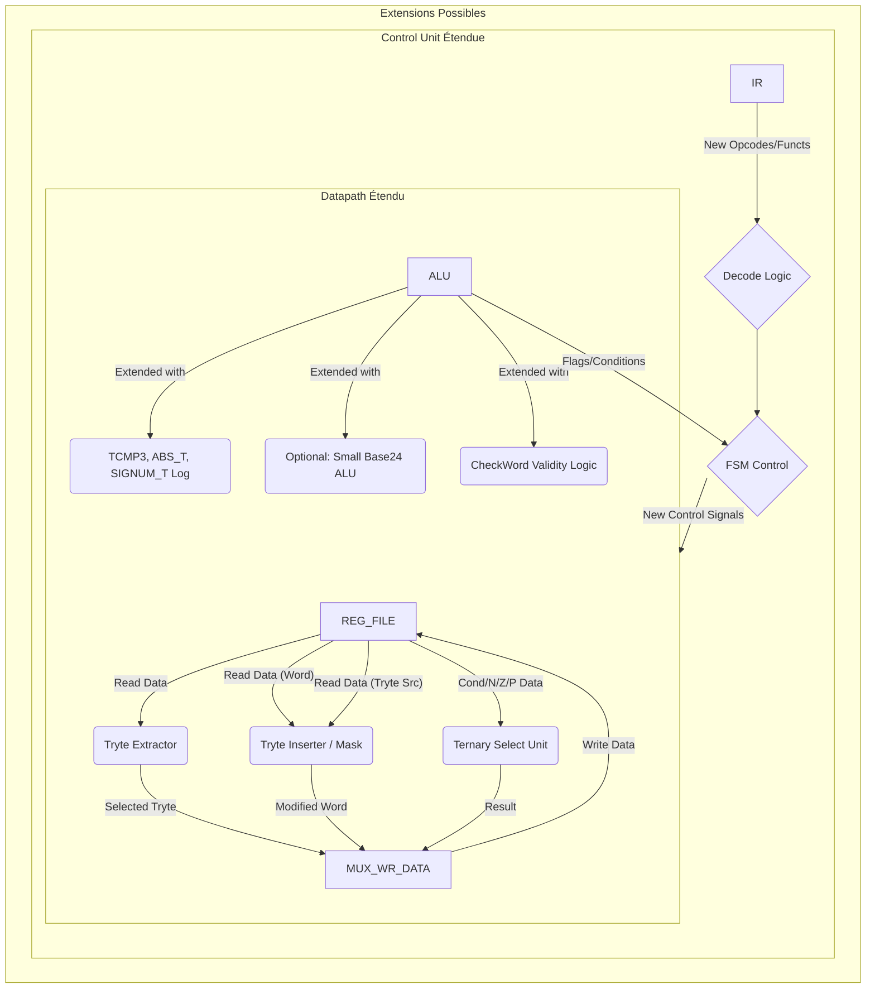

# Sprint 15 VHDL (PrismChrono): Exploitation Ternaire - Instructions Spécialisées & Base 24/60

**Nom de Code Projet :** PrismChrono
**Composant :** `prismChrono_VHDL`

**Objective:** Enrichir l'implémentation VHDL de `prismchrono_core` avec un **premier jeu d'instructions spécialisées conçues pour exploiter les avantages uniques de l'architecture ternaire équilibrée et de la base 24/60**. Ce sprint se concentre sur l'ajout matériel (ALU, datapath, contrôle) pour des opérations qui seraient moins efficaces ou plus complexes à réaliser sur une architecture binaire standard, comme la logique multi-valuée, l'arithmétique Base 24/60 directe, ou la manipulation fine des états spéciaux.

**State:** Not Started

**Priority:** Élevée (Commence à réaliser la promesse différentiante de PrismChrono)

**Estimated Effort:** Large (ex: 15-25 points, T-shirt L/XL - Conception et implémentation de nouvelles unités fonctionnelles ou extensions ALU/datapath, mise à jour contrôle/assembleur)

**Dependencies:**
*   **Sprint 14 VHDL Terminé :** Cœur CPU VHDL stable, optimisé, avec pipeline, cache, MMU, DDR, Interruptions, Atomics, Debug de base fonctionnels.
*   **ISA PrismChrono Étendue (README Simu / Sprint Futur Instruc) :** Définition précise (sémantique, encodage 12t/8t?) des instructions ternaires spécialisées ciblées.
*   **Assembleur (`prismchrono_asm`) :** Doit être mis à jour pour supporter la syntaxe et l'encodage de ces nouvelles instructions.

**Core Concepts:**
1.  **Sélection d'Instructions Cibles :** Choisir un sous-ensemble *pertinent et réalisable* d'instructions spécialisées parmi celles envisagées précédemment (voir discussion "Instructions Spécialisées Potentiellement Avantageuses"). Prioriser celles qui :
    *   Démontrent clairement un avantage ternaire/Base24.
    *   Ne nécessitent pas une refonte matérielle *complète* mais plutôt une extension de l'ALU ou l'ajout d'unités fonctionnelles dédiées (UF) dans l'étage d'exécution (EX).
    *   Ont un cas d'usage identifiable (même si théorique).
2.  **Logique Ternaire Matérielle (Simulée) :** Implémenter la logique fonctionnelle de ces instructions en VHDL, opérant sur la représentation binaire des trits (2 bits/trit).
3.  **Arithmétique Base 24/60 :** Si des instructions Base 24/60 sont choisies, implémenter la logique pour opérer sur les `EncodedTryte` (6 bits) en respectant les règles de ces bases (modulo, gestion retenue spécifique). Peut nécessiter des petites tables de lookup (implémentables en LUTs ou ROMs BRAM) ou de la logique combinatoire dédiée.
4.  **Extension Datapath/Contrôle :**
    *   Ajouter des chemins de données si nécessaire pour acheminer les opérandes vers les nouvelles UFs ou l'ALU étendue.
    *   Ajouter des MUX pour sélectionner le résultat des nouvelles instructions pour l'écriture dans les registres.
    *   Étendre l'unité de contrôle (FSM et logique de décodage) pour reconnaître et piloter l'exécution de ces nouvelles instructions (potentiellement multi-cycles si complexes).

**Instructions Spécialisées Cibles pour ce Sprint (Exemples à Choisir/Confirmer) :**

*   **Logique Multi-Valuée :**
    *   `TCMP3 Rd, Rs1, Rs2`: Comparaison ternaire directe (-1, 0, +1 dans Rd). Extension simple de l'ALU.
    *   `TSEL Rd, Rs_cond, Rs_ifN, Rs_ifZ, Rs_ifP`: Sélection ternaire (MUX 3 vers 1 contrôlé par un trit/registre). Nécessite potentiellement 4 lectures registres ou des étapes multiples. *Alternative :* `TSEL_Trit Rd, Rs_cond(trit_idx), Rs_ifN, Rs_ifZ, Rs_ifP` qui sélectionne basé sur *un seul trit* de Rs_cond.
*   **Arithmétique Symétrique :**
    *   `ABS_T Rd, Rs1`: Valeur absolue ternaire. Extension ALU simple.
    *   `SIGNUM_T Rd, Rs1`: Extraction de signe ternaire. Extension ALU simple.
*   **Manipulation Base 24/Trytes :**
    *   `EXTRACT_TRYTE Rd, Rs1, index(Imm/Rs2)`: Extrait un tryte de Rs1. Nécessite un décaleur/masqueur sur le bus de lecture RegFile.
    *   `INSERT_TRYTE Rd, Rs1, index(Imm/Rs2), Rs_tryte`: Insère un tryte dans Rs1. Nécessite un masqueur/combinateur avant l'écriture RegFile.
    *   `ADD_B24_TRYTE Rd, Rs1, Rs2 (poids faible)`: Additionne les trytes 0 de Rs1/Rs2 en Base 24. Petite ALU Base 24 dédiée (6 bits -> 6 bits + carry ternaire?).
*   **Gestion États Spéciaux :**
    *   `CHECKW_VALID Rd, Rs1`: Vérifie si *tous* les trytes de Rs1 sont valides (pas UNDEF/NULL/NaN). Met P/N dans Rd. Logique de test en parallèle sur le mot.
    *   `IS_SPECIAL_TRYTE Rd, Rs1, index, mask`: Teste un tryte spécifique. Logique d'extraction + test.

**Visualisation des Extensions Possibles :**

**Deliverables:**
*   **Code VHDL Mis à Jour/Nouveaux :**
    *   `rtl/core/alu_24t.vhd` : Étendu avec la logique pour les instructions ternaires/symétriques choisies (`TCMP3`, `ABS_T`, `SIGNUM_T`, `TMIN`/`MAX`/`INV` si pas déjà complets).
    *   `rtl/core/datapath.vhd` : Ajout des chemins/logiques pour `EXTRACT_TRYTE`, `INSERT_TRYTE`, `CHECKW`, `TSEL` si implémentés.
    *   (Optionnel) `rtl/core/base24_alu.vhd` : Petite ALU pour opérations Base 24 sur trytes.
    *   (Optionnel) `rtl/core/ternary_select_unit.vhd` : Unité pour `TSEL`.
    *   `rtl/core/control_unit.vhd` : FSM étendue pour décoder et contrôler les nouvelles instructions (peut nécessiter de nouveaux états ou juste des signaux de contrôle différents dans les états existants).
    *   Mise à jour `rtl/pkg/` : Nouveaux opcodes/fonctions.
*   **Assembleur (`prismchrono_asm`) Mis à Jour :** **Indispensable.** Ajouter la syntaxe et l'encodage pour *toutes* les nouvelles instructions VHDL implémentées.
*   **Testbenches VHDL :**
    *   Nouveaux testbenches unitaires pour les modules ajoutés (ex: `tb_base24_alu.vhd`).
    *   Extension majeure de `tb_pipelined_core.vhd` (ou `tb_prismchrono_core_full_system.vhd`) avec des séquences de test utilisant intensivement les nouvelles instructions spécialisées et vérifiant leur résultat correct (via assertions sur les registres).
*   **Simulation & Synthèse :**
    *   Résultats de simulation validant le fonctionnement des instructions spécialisées.
    *   Rapport de Synthèse/Timing : Évaluer l'impact des nouvelles instructions sur les ressources (LUTs, BRAM) et la FMax.
*   **Documentation :**
    *   `doc/ternary_specialized_instructions.md` : Description détaillée des instructions spécialisées implémentées en VHDL, leur encodage, et leur sémantique.
    *   Mise à jour des autres documents de conception (ALU, Datapath, FSM).

**Acceptance Criteria (DoD - Definition of Done):**
*   Tous les modules VHDL compilent. Les testbenches passent sans erreur d'assertion.
*   L'assembleur `prismchrono_asm` supporte les nouvelles instructions spécialisées.
*   La simulation du testbench système démontre l'exécution correcte des **instructions spécialisées sélectionnées** (ex: `TCMP3` produit N/Z/P, `ABS_T` retourne la magnitude, `EXTRACT_TRYTE` isole le bon tryte, `CHECKW` détecte les mots invalides...).
*   Les nouvelles instructions s'intègrent correctement dans le pipeline (gestion des aléas via forwarding/stall existants, ou ajout de stalls si nécessaire pour des opérations multi-cycles).
*   Le design complet est synthétisé et implémenté. L'impact sur les ressources et la FMax est mesuré et analysé (on s'attend à une augmentation de l'utilisation des LUTs et potentiellement une légère baisse de FMax).
*   La documentation des instructions spécialisées est créée.

**Tasks:**

*   **[15.1] Sélection & Conception Finale Instructions Spécialisées:** Choisir le sous-ensemble à implémenter pour ce sprint (ex: TCMP3, ABS_T, SIGNUM_T, EXTRACT_TRYTE, INSERT_TRYTE, CHECKW). Définir leur sémantique ternaire exacte et leur encodage ISA.
*   **[15.2] Implémentation VHDL - Extensions ALU:** Modifier `alu_24t.vhd` pour inclure la logique combinatoire de TCMP3, ABS_T, SIGNUM_T, CHECKW.
*   **[15.3] Implémentation VHDL - Manipulation Trytes:** Modifier `datapath.vhd` pour ajouter la logique (décaleurs/masques) pour EXTRACT_TRYTE et INSERT_TRYTE.
*   **[15.4] (Optionnel) Implémentation VHDL - Unités Dédiées:** Créer les modules pour `BASE24_ALU` ou `TSEL_UNIT` si ces instructions sont choisies.
*   **[15.5] Mise à Jour Control Unit:** Étendre le décodeur pour reconnaître les nouvelles instructions. Adapter la FSM et la génération des signaux de contrôle pour piloter l'ALU étendue et les nouvelles unités/chemins de données. Gérer les éventuels cycles multiples.
*   **[15.6] Mise à Jour Assembleur:** Ajouter les nouvelles mnémoniques, la syntaxe des opérandes, et l'encodage correspondant dans `prismchrono_asm`.
*   **[15.7] Mise à Jour Testbenches:**
    *   Créer des tests unitaires pour les nouvelles unités si pertinent.
    *   Ajouter des séquences de code assembleur (utilisant le nouvel assembleur) au testbench système pour valider chaque nouvelle instruction spécialisée dans divers scénarios. Utiliser des assertions sur les registres résultats.
*   **[15.8] Simulation & Débogage:** Exécuter les simulations, déboguer les nouvelles instructions et leur intégration pipeline via GTKWave.
*   **[15.9] Synthèse & Analyse Timing/Ressources:** Lancer la chaîne FPGA complète. Analyser l'impact des ajouts sur la taille du design et la FMax.
*   **[15.10] Documentation:** Rédiger `doc/ternary_specialized_instructions.md` et mettre à jour les autres documents.

**Risks & Mitigation:**
*   **Risque :** La logique pour certaines instructions spécialisées (Base24, TSEL complexe) est plus coûteuse en ressources ou plus lente que prévu. -> **Mitigation :** Bien choisir les instructions pour ce premier lot. Commencer par les plus simples (TCMP3, ABS_T...). Évaluer l'impact après implémentation. Reporter les plus complexes si nécessaire.
*   **Risque :** L'ajout des instructions complexifie trop la Control Unit et dégrade le timing. -> **Mitigation :** Essayer d'intégrer la logique dans les états FSM existants autant que possible. Utiliser des unités fonctionnelles dédiées pour découpler la logique.
*   **Risque :** L'assembleur n'est pas mis à jour correctement ou à temps. -> **Mitigation :** Coordonner le développement VHDL et Assembleur. Utiliser des encodages manuels pour les premiers tests VHDL si l'assembleur est en retard.

**Notes:**
*   Ce sprint commence à donner une "saveur" unique à l'implémentation matérielle de PrismChrono.
*   Le choix des instructions spécialisées implémentées ici peut être guidé par les benchmarks du Sprint 13 (simulation) qui auraient pu montrer où le ternaire était potentiellement avantageux mais limité par l'ISA de base.
*   C'est un bon moment pour évaluer si ces instructions apportent un réel avantage (en termes de cycles ou de simplification de code pour certaines tâches) par rapport à leur coût en ressources matérielles.

**AIDEX Integration Potential:**
*   Aide à la conception et à l'écriture du code VHDL pour les logiques ternaires spécialisées (ex: Base24, TSEL, CHECKW).
*   Assistance pour l'extension de la FSM et des signaux de contrôle.
*   Aide à la mise à jour de l'assembleur pour les nouvelles instructions.
*   Génération de code assembleur de test utilisant ces instructions.
*   Analyse assistée des résultats de simulation et de synthèse pour évaluer l'efficacité et le coût des nouvelles instructions.
